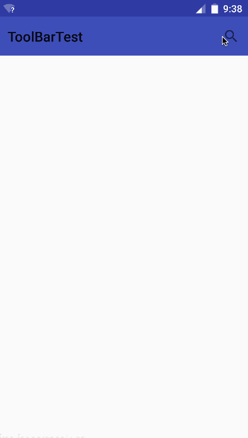

## AndroidPractice
1. 5.0-Partice

   | 名称                     | 效果                                       |
   | ---------------------- | ---------------------------------------- |
   | Palette                |  |
   | circularReveal         |  |
   | explodetransition      |  |
   | fade                   |  |
   | ripple                 |  |
   | shareelementtransition |  |
   | slide                  |  |
   | statelistanimator      |  |
   | tinting                |  |
   | toolbartest            |  |
   | translationz           |  |

   ​

2. JNIDemo

   ​

3. TaiJi

   

4. ExploseParticle

   

5. GuaGuaKa

   

6. Hexagon

   

7. HexagonLayoutManager

   

   ​
